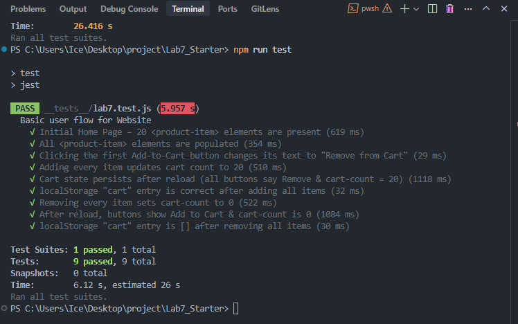

# Lab Week 7 - Unit & E2E Testing

## Question 1

Where would you fit your automated tests in your Recipe project development pipeline? Select one of the following and explain why.

- Within a Github action that runs whenever code is pushed
- Manually run them locally before pushing code
- Run them all after all development is completed

## Answer

Automated tests should run in a GitHub Action on every push because it can catches bugs immediately, ensures a consistennt, a clean enviroment, guarrantees team-wide cCI and prevents "it works on my machine" bugs also saves time in the long run.

## Question 2

Would you use an end to end test to check if a function is returning the correct output? (yes/no)

## Answer

No, end to end tests are used to test the entire application and ensure that all parts are working together correctly. They are not used to test a single function.

## npm test results

## Question 3

What is the difference between navigation and snapshot mode?

## Answer

Navigation mode is used to test the entire application, while snapshot mode is used to test a single page.

## Question 4

Name three things we could do to improve the CSE 110 shop site based on the Lighthouse results.

## Answer

1. Smaller images, and use next gen image formats.
2. Use caching headers for static assets, and needs viewports with width and height attributes.
3. Add accessibility features, and improve SEO.
